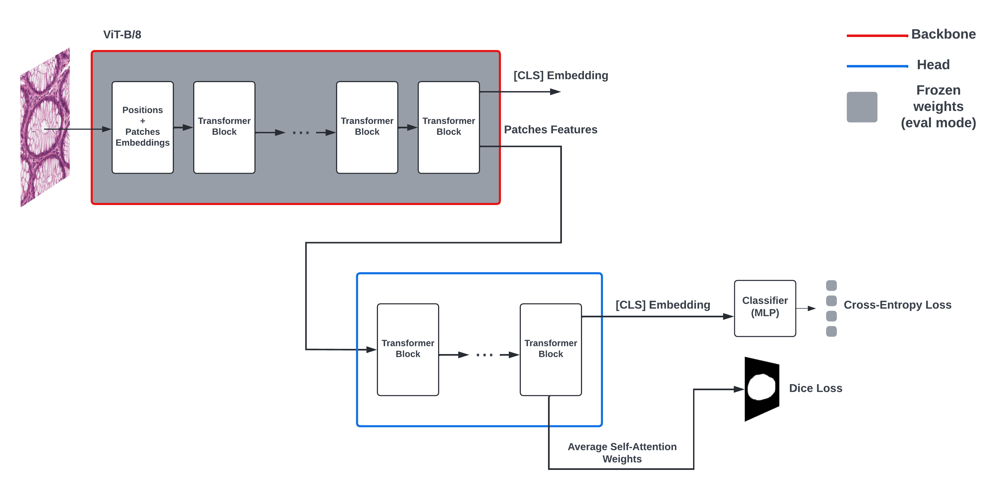
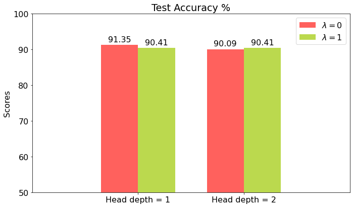

## Guided Soft Attention & Self-Attention for DenseNet & Vision Transformer :robot:

This repository contains the code for the paper `Clinically Guided Soft Attention for AI-Assistance in Histopathology` :books:

The paper that inspired this work is [`Guided Soft Attention Network for Classification of Breast Cancer Histopathology Images`](https://ieeexplore.ieee.org/abstract/document/8873545) :scroll:

### **Project architecture: :fire:**

```
├── data
│   ├── image      <- image patches extracted from Whole Slide images.
│   ├── image_mask <- Segmented glands or could be regions of interest.
|   └── labels  <- Image labels (json format with class stored in the "class" key).
|
├── configs         <- training configuration files
│
├── docs               <- Bibliography, Documentations and Research papers
│
├── notebooks          <- Jupyter notebooks, tutorials ...
│
├── models             <- Models differents configurations and hyperparameters
├── reports            <- Generated analysis as HTML, PDF, LaTeX, etc.
│   └── figures        <- Generated graphics and figures to be used in reporting
│
│
├── src                <- Source code for use in this project.
│   |
│   │
│   ├── data           <- Scripts to preprocess, augment, download or generate data.
│   │
│   │
│   ├── models         <- Scripts to build models and then train them
│   │   └──densenet_gusa.py
|   |
│   ├── train         <- Scripts used in the training pipe, it takes the training data and the
|   |   |                model as arguments and save the model weights or checkpoint to the
|   |   |                model "save_path"
|   |   |
│   │   └──train.py
│   │   └──train_batch.py
│   ├── inference         <- Scripts used in the testing pipe, it takes the test data and
|   |   |                    the model weights as arguments and logs the test results
|   |   |
│   │   └──test.py
│   │
│   │
│   │
│   └── visualization  <- Scripts to create exploratory and results oriented visualizations
|       ├── save_figure.py
│       └── show_grid.py
│
|
├── utils           <- Utility functions for preprocessing images and computing losses
|
├── cfg.yml            <- Configuration YAML file used to configure the pipeline.
|
├── pipeline.py        <- Run a pipline with pre-defined configuration..
|
├── classes.tsv      <- list of classes and corresponding labels (needs to be predefined before
|                       training)
|
|
└── requirements.txt   <- The requirements file for reproducing the analysis environment, e.g.
                          generated with `pipreqs .`
```

### **Installation: :computer:**

**1. clone the repository:**

`git clone git@gitlab.dai-labor.de:empaia/guided-soft-attention.git && cd guided-soft-attention/`

**2. install the dependencies**
--> Make sure you have `pytorch >= 1.11` and `CUDA >=11.3` installed or you can simply:

`pip3 install torch torchvision torchaudio --extra-index-url https://download.pytorch.org/whl/cu113`

--> Then install the extra dependencies using :

`pip install -r requirements.txt`

### **How to run a pipeline? :twisted_rightwards_arrows:**

**1. Modify the configuration YAML file `./example_cfg.yml` in the configs directory or create your own configuration file.**

This is an example of a `process || train || test` pipeline :

```
maintainer: MOHAMED

device: cuda #device on which you want to train the data, use cpu if no nvidia cuda driver is available.

run_name: first_run #name of the run that would be used for wandb

job_type: first_job #name of the job that would be used for wandb

img_dir: ./data/image # directory to image data

mask_dir: ./data/image_mask # directory to image masks

label_dir: ./data/labels # directory to image labels

pipeline:
    - name: process # process pipe used to prepare the data
      train_fraction: 0.75 # proportion of the data to be used for training
      validation_fraction: 0.15 # proportion of the data to be used for validation
      is_augment: true # augmentation will be executed if this is true
    - name: train # train pipe used to training the model
      train_cfg:
          with_augmentation: true # if set to true, data in the '.../augmented' folder will be used for training
          img_size: (384,384)
          epochs: 10
          batch_size: 8
          learning_rate: 0.0003
          lr_decay: 0.1
          lamda: 1
          optimizer: adam
          save_path: ./weights/model_weights.pth
    - name: test # test pipe used to run inference
      test_data: ./data/test.tsv
      test_cfg:
          img_size: (384,384)
          batch_size: 8
          weights: ./weights/model_weights.pth

with_wandb: false # set this to true if you want to use wandb

multi_gpus: false # not supported yet

model_cfg: vit_hd1.yml #the model configuration that would be used, check the possible configurations in the folders /models

random_seed: 2022
```

**2. Run `pipeline.py` while precising the pipline YAML configuration path.**

Example of usage :

```
python3 pipeline.py --cfg './configs/example_cfg.yml'
```

### **Run using docker: :whale:**

1. Building:

```
docker build -f dockerfile -t gusa .
```

1. Running:

```
docker run --ipc=host --gpus all -ti gusa /bin/bash -c "python3 pipeline.py --cfg './configs/example_cfg.yml'"
```

3. Remove docker containers associated to the predefined maintainer:

```
docker rm $(docker ps -a --filter label=maintainer=MOHAMED -q)
```

### **ViT GuSA (Guided Self-Attention) Architecture Overview :wrench:**

<p align="center">

</p>

### **Results :bar_chart:**

The following bar chart represents the test accuracy which was computed using the inference results of different ViT GuSA based models on the test set based on Colon Glands dataset provided by **_Medicine University of Graz_** (which is unfotunately not yet made publicly available).

<p align="center">

</p>
